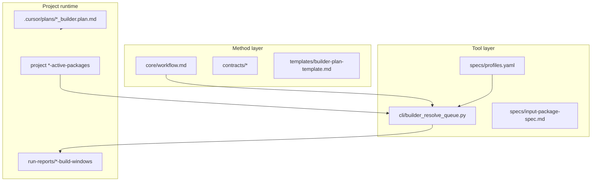

# MANIFEST — Zeya888 Builder Queue

## Что это

**Zeya888 Builder Queue** — методология вайб-кодинга с жёстким контрактом между оператором и AI-агентом:

- **Requirement / Epic / Story** → декомпозиция в task tree
- **Immutable package** (`pkg-*.yaml`) — машиночитаемая очередь
- **Build window** — производный срез для одной сессии Cursor
- **Phases P0–P8** — onboarding, plan, execute, audit, gap scaffold, commits

## Три слоя SSOT

| Слой | Где править | Когда |
|------|-------------|-------|
| **Method** | `core/`, `contracts/`, `templates/` | Изменение процесса, промптов, правил |
| **Tool** | `cli/`, `specs/profiles.yaml` | Новый проект, пути, CLI |
| **Runtime** | `.cursor/plans/`, `pkg-*.yaml` в проекте | Операционная работа, текущий pkg |

## Карта файлов

| Файл | Роль |
|------|------|
| [`core/session-starter.md`](./core/session-starter.md) | Phase 0 onboarding, OPERATOR CONFIG |
| [`core/workflow.md`](./core/workflow.md) | Короткие промпты **PA**, P1–P8 |
| [`core/workflow-legacy.md`](./core/workflow-legacy.md) | Полные self-contained промпты |
| [`cli/queue-manual.md`](./cli/queue-manual.md) | Справочник CLI |
| [`specs/input-package-spec.md`](./specs/input-package-spec.md) | Контракт YAML пакета |
| [`specs/profiles.yaml`](./specs/profiles.yaml) | Реестр проектов |
| [`examples/reference-plans/`](./examples/reference-plans/) | Teaching snapshots — не runtime SSOT |
| [`guides/spa-ui-visual-pipeline.md`](./guides/spa-ui-visual-pipeline.md) | Spa UI Visual Pipeline — полный SSOT UI-0..UI-3 (visual/mixed tasks) |
| [`guides/builder-artifact-dates.md`](./guides/builder-artifact-dates.md) | Дисциплина дат pkg / gate / run-summary; `--print-utc-now`, `--check-dates` |
| [`guides/fixed-builder-plan-execution.md`](./guides/fixed-builder-plan-execution.md) | Fixed `*_builder.plan.md`: @attach, не Build; отвязка от чужого чата Cursor |
| [`templates/story-acceptance-gate-template.md`](./templates/story-acceptance-gate-template.md) | Шаблон story gate с Date discipline |
| [`curriculum/00-guide-for-humans.md`](./curriculum/00-guide-for-humans.md) | Wrapping: метод для человека, роль архитектора |
| [`curriculum/06-architect-studio-and-p1-intakes.md`](./curriculum/06-architect-studio-and-p1-intakes.md) | Studio = PA chat; gap; три P1 intakes |
| [`curriculum/learning-path.md`](./curriculum/learning-path.md) | Маршрут модулей 0–6 (Human + Operative) |
| [`contracts/scripts-operator-contract.md`](./contracts/scripts-operator-contract.md) | Operator contract для `builder_project: scripts` (tooling) |
| [`contracts/capybara-operator-contract.md`](./contracts/capybara-operator-contract.md) | Operator contract для `builder_project: capybara` (Vue+Node + CLI) |
| [`guides/add-builder-profile.md`](./guides/add-builder-profile.md) | SSOT bootstrap нового профиля + Gateway clone |

## Исторические пути

Артеfactы до миграции (build-windows, story gates, run-summaries) могут ссылаться на `docs/methodology/builder-queue/`. Это **исторический контекст**; операционные команды — только `Zeya888-builder-queue/cli/`.

## Propagation checklist

При изменении методологии обновить:

1. `core/workflow.md` (если меняются промпты)
2. `.cursor/skills/builder-session/SKILL.md`
3. `.cursor/rules/builder-operator-habits.mdc`
4. Соответствующий `contracts/*-operator-contract.md`
5. `CHANGELOG.md` + bump `VERSION`

**Не** править `examples/reference-plans/` для runtime — только при обновлении учебного снимка.
