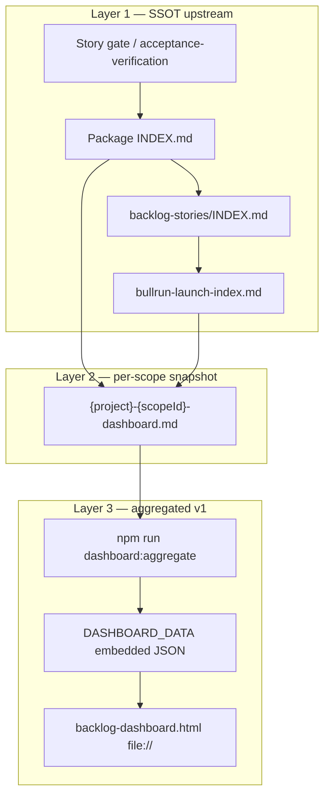

# Backlog dashboard — автоматизация статусов и состояний

> **Связанный план реализации:** [`.cursor/plans/aggregated_backlog_dashboard_e3205c9d.plan.md`](../../../../.cursor/plans/aggregated_backlog_dashboard_e3205c9d.plan.md)  
> **Housekeeping (upstream):** [`docs/analysis/backlog-tasks-housekeeping-playbook.md`](../../../analysis/backlog-tasks-housekeeping-playbook.md)  
> **Per-scope sync:** [`workflow/backlog-dashboard-maintenance.md`](../workflow/backlog-dashboard-maintenance.md) · [`workflow/backlog-dashboard-template.md`](../workflow/backlog-dashboard-template.md)  
> **Метод верификации:** [`.cursor/rules/analysis.mdc`](../../../../.cursor/rules/analysis.mdc)

Документ фиксирует **что именно автоматизируется** в цепочке «статус story → snapshot → aggregated HTML», а что остаётся **ручным / code-verified** upstream. Все утверждения ниже проверены по существующим артефактам на диске (2026-07-09).

---

## 1. Три слоя данных



| Слой | Артефакт | Кто меняет статус | Автоматизация |
|------|----------|-------------------|---------------|
| 1 | Story file, package `INDEX.md`, bullrun | Оператор / P6 / housekeeping (code-verified) | **Нет** — только human + analysis.mdc |
| 2 | `{project}-{scopeId}-dashboard.md` (legacy: `*-backlog-dashboard.md`) | Housekeeping / checklist per close | **Полуавто** — recount из INDEX/REQ/doc-task, ручная правка md |
| 3 | `backlog-dashboard.html` | `aggregate-snapshots.js` (STORY-SCR-DASH-01) | **Да** — parse snapshot → JSON → HTML render |

**v1 aggregated dashboard не выводит статус story напрямую из кода или INDEX.** Он **читает уже нормализованный snapshot** (решение интервью 2026-07-09, см. план §«Почему не parse INDEX в v1»).

---

## 2. Канон статусов story (Layer 1)

Источник: [`backlog-tasks-housekeeping-playbook.md`](../../../analysis/backlog-tasks-housekeeping-playbook.md) §Фаза 3.1.

| Статус | Смысл | В denominator дашборда | Пример на диске |
|--------|-------|------------------------|-----------------|
| `Done` | Story закрыта; evidence в gate/pkg/run-report | **Да** (числитель progress) | spa `search-and-filters/INDEX.md` — 7/7 Done |
| `Todo` | Открыта, в активном backlog | **Да** (знаменатель) | gateway `GW-DEPLOY-01` |
| `Deferred` | POST-MVP / явно отложена | **Нет** в **active** denominator (колонка Deferred + §Deferred) | spa `SEC-02` |
| `Accumulating` | Registry / housekeeping batch, не wave | **Нет** в product % (или отдельная метрика) | spa `HK01` |
| `Superseded` | Заменена другой story | **0** в denominator | spa `CAB-01-from-me` |

**Active work items (канон 2026-07-24):** в Summary `done`/`todo` и **Overall progress (active)** входят product stories **+** REQ (в scope) **+** doc-tasks. Deferred / Superseded / baseline SoT REQ — вне active %. Канон секций: [`backlog-dashboard-template.md`](../workflow/backlog-dashboard-template.md).

**Правило смены статуса (не автоматизируется v1):** без path evidence в коде или артеfact — статус **не менять** (playbook §Фаза 2, analysis.mdc).

### Emoji vs plain text

- Package `INDEX.md`: plain `Done` / `Todo` / … (playbook)
- Bullrun / backlog INDEX: emoji допустимы (`🟢 Done`, `🔵 Backlog`) — **парсер v1 их не читает**
- Snapshot Summary: агрегированные **числа** (`Done: 30`, `Todo: 9`) — источник для Layer 3

---

## 3. Канон состояний epic rollup (Layer 2)

Epic rollup в snapshot — **derived**, не отдельный SSOT. Формат verified по существующим дашбордам:

| Epic status (snapshot) | Когда ставить | Verified example |
|----------------------|---------------|------------------|
| `Done` | Все product stories эпика Done (deferred exclude) | identity `EPIC-IDS-01…06` |
| `In Progress` | ≥1 open story, epic не closed | gateway `EPIC-M2-21` |
| `Todo` | Epic не стартовал | spa `EPIC-SPA-07` |
| `POST-MVP` | Пакет deferred целиком | identity `eid-deferred`, `auth-bff` |

Snapshot **не хранит** machine-readable YAML — только markdown-таблица `## Epic rollup`. Агрегатор v1 парсит колонки `Epic | Status | Notes` verbatim в JSON `epics[]`.

---

## 4. Что автоматизирует v1 (STORY-SCR-DASH-01)

### 4.1 Вход: registry snapshot paths

| CLI key | Snapshot path |
|---------|----------------|
| `gateway` | `doge-complaints-gateway/docs/tasks/gateway-mvp-dashboard.md` |
| `gpt` | `GPT UI/docs/tasks/gpt-mvp-dashboard.md` |
| `identity` | `doge-identity-service/docs/tasks/identity-backlog-dashboard.md` (legacy name) |
| `spa` | `spa-app/docs/tasks/spa-backlog-dashboard.md` (legacy name) |
| `scripts` | `scripts/docs/tasks/scripts-backlog-dashboard.md` (legacy name) |
| `capybara` | `capybara/docs/tasks/capybara-backlog-dashboard.md` (legacy name) |

`gateway`/`gpt` — scope-id naming (`mvp`) с 2026-07-24. Остальные — legacy `*-backlog-dashboard.md` до rename.

### 4.2 Parse contract (snapshot → JSON)

Секции snapshot, которые **обязан** понимать парсер:

| Секция markdown | JSON поле | Поля статуса / состояния |
|-----------------|-----------|--------------------------|
| Header `Updated:` | `projects[].updated` | дата свежести (stale badge >14d в UI) |
| `## Summary` table | `projects[].summary` | `done`, `todo`, `deferred`, `accumulating`, `progress_pct` |
| `## By package` | `projects[].packages[]` | per-package `done`/`todo`/… + `progress_bar` (12 chars) |
| `## Epic rollup` | `projects[].epics[]` | `status`, `notes` — **состояние трека** |
| `## Next recommended waves` | `projects[].next_waves[]` | приоритет волн (не status enum) |

**Overall progress:** берётся из Summary (`**Overall progress (active)**` или `**Overall progress**`), не пересчитывается агрегатором. `summary.stories` ← метрика `Active work items` (или legacy `Product stories`).

### 4.3 Global rollup (cross-project)

Агрегатор **суммирует** `summary` по projects:

```javascript
global: {
  project_count,
  total_stories,   // sum(summary.stories) — product denominator
  total_done,      // sum(summary.done)
  overall_pct      // round(100 * total_done / total_stories)
}
```

Исключения denominator (deferred packages, aux) **уже учтены** в snapshot upstream — агрегатор не re-apply правила exclude.

### 4.4 Что v1 **не** делает

- Не grep код, не читает story gates
- Не меняет `INDEX.md`, bullrun, story files
- Не resolve конфликты SSOT (порядок см. §6)
- Не fetch по сети; HTML `file://` + embedded JSON only

---

## 5. Цепочка обновления (operator workflow)

```text
1. Story close (P6) или housekeeping wave
   → обновить Layer 1 (story, package INDEX, bullrun)
2. Recount + update `{project}-{scopeId}-dashboard.md` (Layer 2)
   → checklist: backlog-dashboard-maintenance.md · template
3. npm run dashboard:aggregate (Layer 3)
   → patch DASHBOARD_DATA in backlog-dashboard.html
4. Open file:// backlog-dashboard.html — verify global + per-project numbers
```

**Trigger Layer 3:** после шага 6 maintenance checklist (per-project snapshot) или после batch housekeeping по всем 5 проектам.

---

## 6. SSOT order при конфликтах

Из [`backlog-dashboard-maintenance.md`](../workflow/backlog-dashboard-maintenance.md):

1. Pipeline story gate / acceptance-verification
2. Package `INDEX.md`
3. Root `backlog-stories/INDEX.md`
4. `bullrun-launch-index.md`
5. `{project}-{scopeId}-dashboard.md` (derived; legacy `*-backlog-dashboard.md`)
6. **`backlog-dashboard.html` / JSON** (derived ×2 — **самый нижний приоритет**)

Если aggregated JSON ≠ snapshot → **чинить snapshot upstream**, не править JSON вручную в HTML.

---

## 7. Progress bar — единая формула

Verified: maintenance doc + все 4 snapshot (2026-07-09).

```text
filled = round(12 * done / total_stories)   // clamp 0..12
bar    = "█".repeat(filled) + "░".repeat(12 - filled)
pct    = round(100 * done / total_stories)
```

Package row `Progress` column: `75% \`█████████░░░\`` — парсер извлекает **оба** для JSON (`progress_pct`, `progress_bar`).

---

## 8. Stale и audit trail

| Signal | Источник | UI behavior (DASH-02) |
|--------|----------|------------------------|
| Snapshot date | `Updated: YYYY-MM-DD` в md header | pill «stale» if >14 days |
| Code-verified audit | `{app}/docs/analysis/backlog-status-audit-*.md` | link in per-project accordion (path only, не parse v1) |
| `generated_at` | JSON от aggregate script | header pill aggregated HTML |

Audit file **не** feed aggregated JSON в v1 — только ссылка для оператора (analysis.mdc traceability).

---

## 9. v2 roadmap — parse INDEX (out of scope v1)

План [`aggregated_backlog_dashboard_e3205c9d`](../../../../.cursor/plans/aggregated_backlog_dashboard_e3205c9d.plan.md) откладывает на отдельную story:

| Задача v2 | Сложность | Зависимость |
|-----------|-----------|-------------|
| Unified parser `backlog-stories/*/INDEX.md` | High — heterogeneous tables (spa vs identity vs gpt) | Status normalization map §2 |
| Skip Layer 2 snapshot для aggregate | Medium | Stable package INDEX format per app |
| capybara via `ROADMAP.md` + INDEX | Done (DASH-03) | [`capybara-backlog-dashboard.md`](../../../../capybara/docs/tasks/capybara-backlog-dashboard.md) |
| Optional: regen snapshot from INDEX (inverse) | Medium | Single `recount-dashboard.js` per profile |

До v2 **snapshot остаётся обязательным** промежуточным SSOT для aggregated view.

---

## 10. Связь со stories (scripts tooling)

| Story | Path | Automation scope |
|-------|------|------------------|
| STORY-SCR-DASH-01 | [`STORY-SCR-DASH-01-snapshot-aggregator.md`](../../../../scripts/docs/tasks/backlog-stories/builder-console/STORY-SCR-DASH-01-snapshot-aggregator.md) | Parse Layer 2 → JSON; bootstrap `scripts-backlog-dashboard.md` |
| STORY-SCR-DASH-02 | [`STORY-SCR-DASH-02-backlog-dashboard-html.md`](../../../../scripts/docs/tasks/backlog-stories/builder-console/STORY-SCR-DASH-02-backlog-dashboard-html.md) | Render JSON; stale badge; sort by `progress_pct` |
| STORY-SCR-DASH-03 | [`STORY-SCR-DASH-03-capybara-dashboard-registry.md`](../../../../scripts/docs/tasks/backlog-stories/builder-console/STORY-SCR-DASH-03-capybara-dashboard-registry.md) | `capybara-backlog-dashboard.md` + registry (6 projects) |

Deliverable HTML: [`tools/backlog-dashboard.html`](../tools/backlog-dashboard.html) · Epic: [`EPIC-SCR-TOOLING`](../../../../scripts/docs/tasks/backlog-stories/builder-console/EPIC-SCR-TOOLING.md)

---

## 11. Verification checklist (post-aggregate)

- [ ] `npm run dashboard:aggregate` exit 0
- [ ] spa `summary.progress_pct` = 75 (matches [`spa-backlog-dashboard.md`](../../../../spa-app/docs/tasks/spa-backlog-dashboard.md))
- [ ] identity Done=29, Todo=4, Accumulating=1 (matches snapshot)
- [ ] gpt 100% — 2/2 stories
- [ ] gateway deferred column parsed if present
- [ ] HTML opens `file://` without network; 5 project sections
- [ ] Manual spot-check: epic `In Progress` chips match snapshot tables

---

## References (verified paths)

| Artifact | Path |
|----------|------|
| Plan | `.cursor/plans/aggregated_backlog_dashboard_e3205c9d.plan.md` |
| Gateway snapshot | `doge-complaints-gateway/docs/tasks/gateway-mvp-dashboard.md` |
| GPT snapshot | `GPT UI/docs/tasks/gpt-mvp-dashboard.md` |
| Template | [`workflow/backlog-dashboard-template.md`](../workflow/backlog-dashboard-template.md) |
| Identity snapshot | `doge-identity-service/docs/tasks/identity-backlog-dashboard.md` |
| SPA snapshot | `spa-app/docs/tasks/spa-backlog-dashboard.md` |
| SPA audit example | `spa-app/docs/analysis/backlog-status-audit-2026-07-09.md` |
| Aggregated HTML (operator UI) | [`tools/backlog-dashboard.html`](../tools/backlog-dashboard.html) |
| Aggregate command | `npm run dashboard:aggregate` (repo root) |
