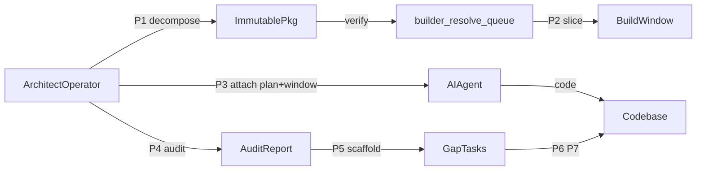

# Zeya888 Builder Queue — гид для человека

Этот документ — **обёртка** над методологией. Здесь нет operative промптов для вставки в Cursor: они живут в [`../core/workflow.md`](../core/workflow.md) и [`../core/session-starter.md`](../core/session-starter.md). Здесь — смысл, ценность и роль архитектора-оператора.

**Аудитория:** AI-driven developer, solo builder, архитектор, который хочет строить сложные системы с агентом, не превращаясь в «промпт-оператора без системы».

---

## 1. Какую проблему решает метод

Vibe-coding без дисциплины быстро упирается в одни и те же сбои:

- **Агент «помнит» порядок задач** — на самом деле он реконструирует его из контекста чата. После смены story или нового чата порядок может расходиться с реальным backlog.
- **Plan и execution смешиваются** — в одном сообщении просят «разбей эпик и сразу напиши код». Итог: неполная декомпозиция, пропущенные AC, нет immutable очереди.
- **Один чат = один перегруженный контекст** — без узкого среза агент тащит весь эпик, путает story, «закрывает» задачи по памяти.
- **Нет traceability** — сложно ответить: «этот коммит закрывает какой requirement / story / task?»

**Zeya888 Builder Queue** — не «ещё один agile-фреймворк». Это **операционная дисциплина** между человеком и AI: кто что решает, какие артефакты фиксируют договорённость, где машина проверяет, что договор не сломан.

---

## 2. Что это такое простыми словами

Метод связывает три типа артефактов:

| Артефакт | Роль | SSOT |
|----------|------|------|
| **pkg YAML** (`pkg-*.yaml`) | Immutable очередь: «какие task README делать дальше» | [`../specs/input-package-spec.md`](../specs/input-package-spec.md) |
| **Build window** | Узкий срез очереди для **одной** сессии Cursor | Производный; перегенерируется CLI |
| **Phases P0–P8** | Разделение: думать / резать / делать / проверять / закрывать | [`../core/workflow.md`](../core/workflow.md) |

Между сессиями «память» проекта — не чат, а **файлы на диске**: bullrun index, active package pointer, task README, audit reports.

**Метафора:** архитектор проектирует железную дорогу (pkg + contracts). Машинист (агент) едет по рельсам (build window). Диспетчер (`--verify`) не пускает поезд, если на пути красный сигнал — битый контракт или несуществующий файл.

---

## 3. Как работает один цикл (язык процессов)

0. **Architect Studio (опционально)** — отдельный чат для **PA Intake Analysis**: сырой черновик → canonical intake на диске ([`workflow.md`](../core/workflow.md) §PA). Skip, если файл уже Builder-ready.
1. **PA → P1** — intake-якорь (requirement, epic или backlog story) → декомпозиция в EPIC → STORY → task README ([`workflow.md`](../core/workflow.md) §P1.1–P1.3).
2. **P1 Plan** — immutable `pkg-*.yaml` и `*-active-package.current.yaml`.
3. **Verify** — CLI проверяет paths из pkg. FAIL = стоп.
4. **P2 Build window** — slice для одной сессии Cursor.
5. **P3 Execute** — builder plan + build window; шаг 0 verify.
6. **P4 Audit** — cross-audit по коду; findings, без fix.
7. **P5 Gap scaffold** — task-папки; без pytest.
8. **P6 Execute gaps** · **P7 Re-audit**
9. **P8 Commits** — scope anchor; task docs по умолчанию не коммитятся.

Подробнее по каждой фазе: [`03-workflow-phases-explained.md`](./03-workflow-phases-explained.md).

---

## 4. Ценность для AI-Driven developers

- **Machine-readable queue** — порядок work берётся из `pkg-*.yaml` и `--list`, не из «памяти» агента. Operator contracts ([`../contracts/`](../contracts/)) запрещают выдумывать очередь.
- **Verify gate** — объективная проверка до execution. Красный сигнал = правим YAML или paths, а не спорим с моделью в чате.
- **Phase separation** — Plan mode (P1, P5) и Agent mode (P3, P6) в разных сообщениях и часто в разных чатах. Меньше смешения «спроектируй и сразу закодируй».
- **Traceability** — цепочка requirement → epic → story → task README → pkg path → commit scope. Удобно для audit и обучения команды.

---

## 5. Ценность для Solo builders

Один человек играет PM, architect, reviewer и иногда implementer. Метод даёт **артефакты команды**:

- **Bullrun index** — где мы в волне, что Done, что Todo.
- **Active pkg** — что делать прямо сейчас, без перечитывания всего эпика.
- **Build window** — дешёвый reset контекста: новый чат, тот же slice очереди.
- **Audit reports** — внешний взгляд на код без «сам себя проверил в том же чате».

Solo builder не обязан помнить 40 task README — достаточно соблюдать фазы и держать SSOT на диске.

---

## 6. Архитектор остаётся архитектором

Сложные системы строятся, когда человек **держит границы и контракты**, а агент **исполняет внутри них**. Метод явно разделяет, где вы думаете системно, а где делегируете.

| Фаза | Роль архитектора | Что не делать |
|------|------------------|---------------|
| **P0** | Выбор `builder_project`, проверка layout, tests, active pkg на диске | Не просить «сразу код» до onboarding |
| **P1** | Декомпозиция, AC, границы epic/story, design pkg | Не микроменеджить implementation в Plan mode |
| **P2** | Выбор slice: story-key, flat, gim-slice | Не править build window руками как SSOT |
| **P3** | Attach plan + window, контроль verify на шаге 0 | Не переписывать очередь текстом в чате |
| **P4** | Интерпретация findings, severity, приоритет | Не смешать audit с fix в том же промпте |
| **P5** | Gap → task scaffold; override vs новый pkg | Не просить pytest / implementation в P5 |
| **P6–P7** | Приоритизация gap closure, re-audit | — |
| **P8** | Scope commits, git hygiene | Не коммитить `docs/tasks/**` без явной команды |

**Продвинутый архитектор** в этой модели не пишет каждый файл руками — он **проектирует пространство решений**: какие stories, какие AC, какой порядок в pkg, когда audit, когда gap wave. Агент заполняет implementation внутри task README. Архитектурное мышление остаётся у человека, потому что P1, P4, P5 требуют системного взгляда; P3 — тактического исполнения по контракту.

---

## 7. Три слоя SSOT (человечески)

Из [`../MANIFEST.md`](../MANIFEST.md):

| Слой | Где | Когда править |
|------|-----|---------------|
| **Method** | `core/`, `contracts/`, `templates/` | Меняется процесс, промпты, правила оператора |
| **Tool** | `cli/`, `specs/profiles.yaml` | Новый проект, пути, команды CLI |
| **Runtime** | `.cursor/plans/*_builder.plan.md`, `pkg-*.yaml` в проекте | Операционная работа, текущая волна |

При обучении читайте **Method + curriculum**. В production attach **Runtime** plan + build window. Reference plans в [`../examples/reference-plans/`](../examples/reference-plans/) — только для разбора структуры, не для P3.

---

## 8. Учебный маршрут

| # | Для человека | Operative (когда готовы) |
|---|--------------|---------------------------|
| 0 | Этот документ | [`../MANIFEST.md`](../MANIFEST.md) |
| 1 | [`01-first-session.md`](./01-first-session.md) | [`../core/session-starter.md`](../core/session-starter.md) |
| 2 | [`02-first-package-and-window.md`](./02-first-package-and-window.md) | [`../specs/input-package-spec.md`](../specs/input-package-spec.md) |
| 3 | [`03-workflow-phases-explained.md`](./03-workflow-phases-explained.md) | [`../core/workflow.md`](../core/workflow.md) |
| 4 | [`04-cli-and-contracts-explained.md`](./04-cli-and-contracts-explained.md) | [`../cli/queue-manual.md`](../cli/queue-manual.md) |
| 5 | [`05-connect-your-project.md`](./05-connect-your-project.md) | [`../integration/cursor-setup.md`](../integration/cursor-setup.md) |
| 6 | [`06-architect-studio-and-p1-intakes.md`](./06-architect-studio-and-p1-intakes.md) | [`../core/workflow.md`](../core/workflow.md) §P1 |

**Architect Studio vs Builder:** отдельный per-project чат для **PA (Intake Analysis)** — дозреть intake-файл; без pkg и без P3. Builder-сессия: P1+ с одним `input_mode`. Подробно — модуль 6 · operative §PA в [`workflow.md`](../core/workflow.md).

Полная карта: [`learning-path.md`](./learning-path.md).

---

## 9. Частые вопросы

**Это заменяет agile/scrum?**  
Нет. Это слой **исполнения с AI** поверх ваших epics/stories. Bullrun index и task tree совместимы с привычным backlog.

**Нужен ли Cursor?**  
Метод заточен под Cursor (skill, rules, `@`-attach). CLI и YAML работают из терминала; IDE — удобная оболочка.

**Можно ли без DOGEstonia?**  
Да. Скопируйте `Zeya888-builder-queue/`, настройте [`profiles.yaml`](../specs/profiles.yaml) и builder plan — см. модуль 5.

**Зачем external audit (P4)?**  
Свежий контекст и другая модель снижают «слепоту» того же чата, где писали код.
