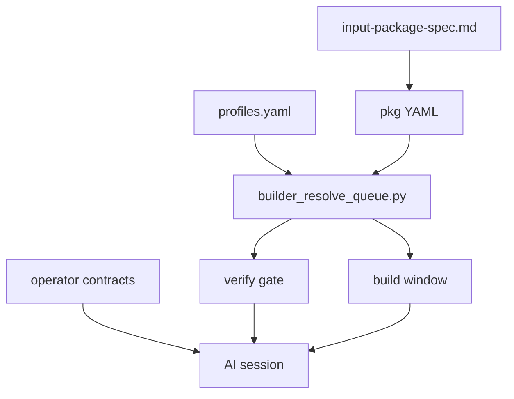

# Модуль 4 — CLI, specs и operator contracts

**Operative SSOT:** [`../cli/queue-manual.md`](../cli/queue-manual.md), [`../specs/input-package-spec.md`](../specs/input-package-spec.md), [`../contracts/`](../contracts/)  
**Контекст:** [`00-guide-for-humans.md`](./00-guide-for-humans.md)

Инструменты метода — не «магия терминала», а **проверяемые границы** между архитектором и агентом.

---

## Зачем CLI [`builder_resolve_queue.py`](../cli/builder_resolve_queue.py)

Скрипт — мост между **YAML на диске** и **сессией Cursor**. Он не планирует и не пишет код. Он:

1. Находит корень workspace по [`profiles.yaml`](../specs/profiles.yaml).
2. Читает `*-active-package.current.yaml` → `pkg-*.yaml`.
3. Нормализует очередь paths (контракт [`input-package-spec.md`](../specs/input-package-spec.md)).
4. Проверяет exists (`--verify`) или генерирует build window.

**Архитектор:** доверяет verify как objective gate, не спорит с FAIL в чате.

---

## Команды простым языком

| Команда | Человеческий смысл |
|---------|-------------------|
| `--verify` | «Все ли task README из active pkg реально существуют?» |
| `--list` | «Покажи нумерованную очередь README из pkg» |
| `--print-next` | «Какой следующий path в очереди?» |
| `--export-active-task-path` | «Одна строка для shell/скриптов» |
| `--write-build-window` | «Вырежи slice в markdown для attach в P3» |
| `--write-next-pointer` | «Обнови dotfile указатель next README» |

Детали флагов и профили: [`queue-manual.md`](../cli/queue-manual.md).

### Verify — красный и зелёный сигнал

**Зелёный:** `ok N paths` — можно P2/P3 (после выбора slice).  
**Красный:** битый path, пустой pointer, несуществующий pkg — **исправить YAML/дерево**, не execution.

### Build window — производный артеfact

Окно — **снимок** очереди для одного чата. После смены pkg или task tree — перегенерировать. Symlink `latest-cursor-build-window.md` — UX для Cursor (Cmd+P), не SSOT.

---

## Input package spec — что внутри pkg

Из [`input-package-spec.md`](../specs/input-package-spec.md):

| Понятие | Смысл для архитектора |
|---------|----------------------|
| `input_kind` | Как pkg был создан: `epic_story_tree`, `task_list_linear`, `epic_decompose_pending`, … |
| `story_groups` | Группы paths по story_key (gateway/identity) |
| `epic_file` | Якорь эпика для traceability |
| `package_sequence` | Монотонный номер волны (pkg-000015, …) |
| paths | От **корня workspace** — каждый → task `README.md` |

**Immutable:** после закрытия волны pkg не переписывают задним числом; новая волна — новый `pkg-*.yaml` + pointer.

Поля profiles: [`profiles-fields.md`](../specs/profiles-fields.md).

---

## Operator contracts — три напоминания на сессию

Contracts — **не дубли workflow**, а process reminders для конкретного `builder_project`. Агент должен выполнять их **каждую** сессию (skill + rule propagation).

### Gateway — [`gateway-operator-contract.md`](../contracts/gateway-operator-contract.md)

1. Старт из bullrun index + active pkg + verify.  
2. Build window по `--story-key`.  
3. Sync index после каждой story.

**Архитектор:** story-level slices, epic tree M2-*.

### GPT — [`gpt-operator-contract.md`](../contracts/gpt-operator-contract.md)

1. Index + pkg + verify; порядок из `--list`, не из памяти.  
2. EPIC без строки в index = не декомпозирован → P1, не P3.  
3. Sync index после каждого task.  
4. `run_mode` override только по явной команде.

**Архитектор:** flat/GIM slices, audit followup waves (req33, req36, …).

### Identity — [`identity-operator-contract.md`](../contracts/identity-operator-contract.md)

1. Index + pkg + verify; только `EPIC-IDS-*` из `epics/`.  
2. Epic без task queue → decompose, не execute.  
3. Sync index per task/story.  
4. Один `input_mode` / `run_mode` на сессию; P4 якоря по mode §5.

**Архитектор:** epic-first, backlog_story intake (P1.3).

---

## Как CLI, spec и contracts работают вместе

---

## Практика модуля

1. `--verify` для своего `--project`.  
2. `--list` — сопоставить с bullrun index.  
3. Прочитать contract своего проекта — три правила «на каждую сессию».  
4. Не вызывать `--write-build-window` до зелёного verify.

## Дальше

[`05-connect-your-project.md`](./05-connect-your-project.md)
