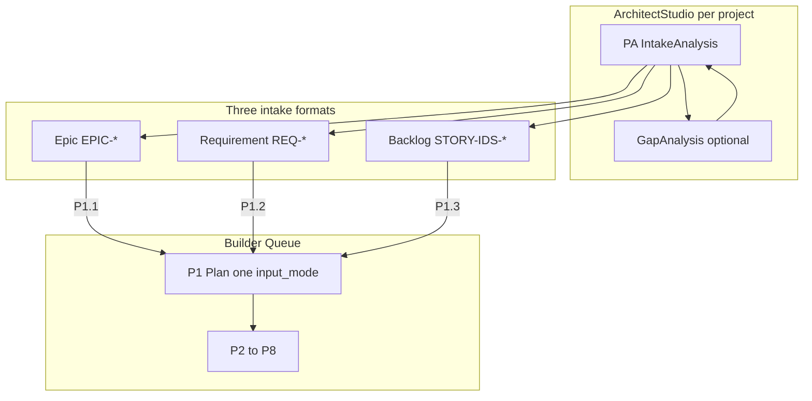
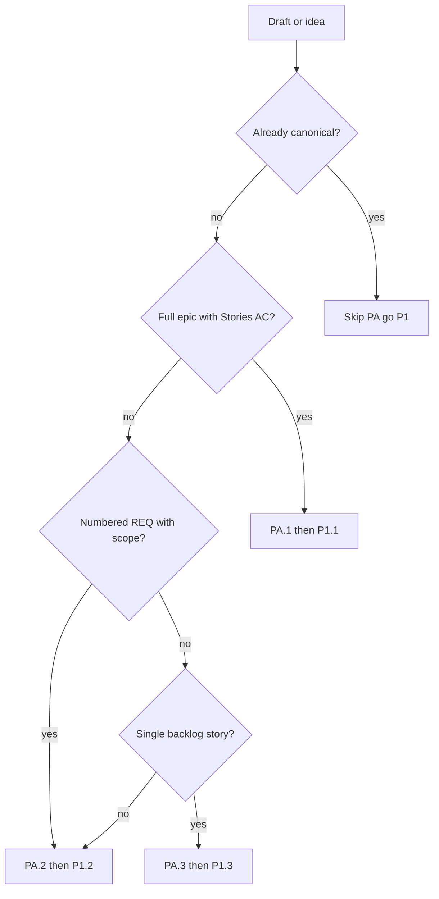

# Модуль 6 — Architect Studio и три входа P1

**Operative SSOT:** [`../core/workflow.md`](../core/workflow.md) §**PA** + §P1.1–P1.3 · [`../contracts/identity-operator-contract.md`](../contracts/identity-operator-contract.md) §4–§5  
**Контекст:** [`00-guide-for-humans.md`](./00-guide-for-humans.md)

Architect Studio — **рекомендуемый отдельный чат** для operative фазы **PA (Intake Analysis)**. Human layer здесь объясняет *зачем*; промпты PA — только в workflow. P1 здесь **не дублируется**.

Перед PA по одному проекту можно стартовать с cross-project orientation: карта gateway / identity / spa / GPT UI и analytics по корневому `docs/` → кандидаты нисходящих story (без materialize). Промпт: [`../prompts/architect/cross-project-system-orientation.md`](../prompts/architect/cross-project-system-orientation.md). Индекс useful prompts: [`../prompts/INDEX.md`](../prompts/INDEX.md).

Если есть высокоуровневый product REQ (напр. в `docs/requirements backlog/`) и нужны дочерние per-project requirements со связями — [`../prompts/architect/parent-requirement-to-project-reqs.md`](../prompts/architect/parent-requirement-to-project-reqs.md), затем PA.2 на каждый Draft child.

Из готового per-project REQ в backlog: **non-UI** → [`../prompts/architect/req-to-backlog-stories.md`](../prompts/architect/req-to-backlog-stories.md) (STORY package); **UI spa/landing** → [`../prompts/architect/req-to-ui-admin-layers.md`](../prompts/architect/req-to-ui-admin-layers.md) (ADMIN-01…06, не сразу STORY). Оба — plan-first, materialize по команде.

---

## 1. Два режима общения (не смешивать)

| Режим | Чат | Цель | Operative |
|-------|-----|------|-----------|
| **Architect Studio** | Отдельный диалог, **per project** | PA: дозреть intake-якорь; gap; audit triage | workflow §**PA**.1–PA.3 |
| **Builder Queue** | Сессия по [`session-starter.md`](../core/session-starter.md) | P0 → **P1** → P2–P8 | workflow §P1+ |



**Ключевое правило:** PA **не** создаёт `pkg-*.yaml` и **не** запускает P3. Выход PA — **`$intakeArtifact`** на диске; затем Builder-сессия — явный P1 с `input_mode`.

---

## 2. Architect Studio = чат для PA

### Контекст per project

Из [`profiles.yaml`](../specs/profiles.yaml):

| `builder_project` | `$intakeDraft` / `$etalonDir` | Analysis zone |
|-------------------|-------------------------------|---------------|
| `gateway` | `doge-complaints-gateway/docs/requirements/`, `$tasksRoot/epics/` | `doge-complaints-gateway/docs/analysis/` |
| `gpt` | `GPT UI/docs/requirements/REQ-*.md` | `GPT UI/docs/analysis/` |
| `identity` | `docs/requirements/`, `backlog-stories/`, `runtime-docs/` | `doge-identity-service/docs/analysis/` |
| `spa` | `spa-app/docs/tasks/backlog-stories/`, `spa-app/docs/requirements/`, `spa-app/docs/UX/` | `spa-app/docs/analysis/` |

### §2.1 Intake refinement = фаза PA

| Вопрос | Ответ |
|--------|-------|
| Что делает PA? | Сырой черновик → **Builder-ready** intake (стиль + глубина как у соседей в `$etalonDir`) |
| Когда **skip** PA? | Файл уже canonical — метаданные, verified state, AC (ориентир: [`REQ-41`](../../../GPT UI/docs/requirements/REQ-41-trigger-observability-audit-trail.md)) |
| Когда **нужен** PA? | Сырой функциональный черновик (ориентир: [`REQ-42`](../../../GPT UI/docs/requirements/REQ-42.md)) |
| Как запустить? | Отдельный Studio-чат → workflow §**PA.2** (requirement), §PA.1 (epic), §PA.3 (backlog story) |
| Что после PA? | Handoff → P1.1 / P1.2 / P1.3 с тем же `@file` |

**Интерактивное интервью** (смысл, не полный промпт): decision points → фиксация в файле; человеческий язык; протокол «Other» — ответ на встречный вопрос оператора, затем повтор/адаптация вопроса.

**Gap analysis** — подпроцесс **внутри PA** при секциях verified-by-code и «Точки в коде», не отдельная методология.

### Типичные темы Studio

- **PA / intake shaping** — главная operative активность
- Gap analysis (код vs целевое) — внутри PA
- Audit triage после P4 — severity, без fix в том же потоке

### Дисциплина analysis.mdc

- Каждый claim — path к файлу/строке или к AC в intake
- «Не реализовано» · «реализовано неверно» · «doc drift»
- PA не переходит к implementation и не создаёт task README

### Пример цепочки (identity, backlog)

1. Gap pass → [`identity-todo-backlog-2026-06-04.md`](../../../doge-identity-service/docs/analysis/identity-todo-backlog-2026-06-04.md)  
2. **PA.3** → [`STORY-IDS-EID-01-eid-verification-flow.md`](../../../doge-identity-service/docs/tasks/backlog-stories/STORY-IDS-EID-01-eid-verification-flow.md)  
3. Builder **P1.3** → [`pkg-000015`](../../../doge-identity-service/docs/tasks/identity-active-packages/pkg-000015-20260606-epic-ids-09-eid-verification-flow.yaml)  
4. P3–P4 → [`epic-ids-09-eid-01-audit-2026-06-06.md`](../../../doge-identity-service/docs/analysis/epic-ids-09-eid-01-audit-2026-06-06.md)

---

## 3. Три формата входа → PA → P1

| PA | P1 | `input_mode` | Якорь `$intakeArtifact` |
|----|-----|--------------|--------------------------|
| PA.1 | P1.1 | `epic_story` | `$epicFile` |
| PA.2 | P1.2 | `requirement` | `$requirementDoc` |
| PA.3 | P1.3 | `backlog_story` | `$storyFile` |

**Запрет:** один `input_mode` на Builder-сессию P1 ([`identity-operator-contract.md`](../contracts/identity-operator-contract.md) §4).

### Decision tree



---

## 4. Три сценария — развёрнуто

### Сценарий A — Epic-first

**Studio:** PA.1 → canonical epic (Goal, Stories, AC).  
**Builder:** P1.1 + `@$epicFile` → workflow §P1.1.

### Сценарий B — Requirement-driven

**Studio:** **PA.2** shape сырой REQ (напр. [`REQ-42`](../../../GPT UI/docs/requirements/REQ-42.md) → стиль [`REQ-41`](../../../GPT UI/docs/requirements/REQ-41-trigger-observability-audit-trail.md)); gap «код vs REQ» — внутри PA при verified §.  
**Builder:** P1.2 + `@$requirementDoc`; reuse эпика ([`builder-operator-habits.mdc`](../../../.cursor/rules/builder-operator-habits.mdc) §6).

**Не путать:** PA.2 shape requirement ≠ P1.2 decompose в tasks.

### Сценарий C — Backlog story

**Studio:** gap → **PA.3** → canonical backlog story ([EID-01 example](../../../doge-identity-service/docs/tasks/backlog-stories/STORY-IDS-EID-01-eid-verification-flow.md)).  
**Builder:** P1.3 — materialize epic при необходимости; не полный epic-decompose домена.

---

## 5. PA, gap, P4 audit

| Стадия | Где | Роль архитектора | Выход |
|--------|-----|------------------|-------|
| **PA** | Studio / workflow §PA | Shape intake; interview | `$intakeArtifact` |
| Gap (в PA) | Verified §, «Точки в коде» | Paths; целевое | строки в intake |
| P4 audit | После P3 | Severity | `$auditReport` → P5 / новый PA |

P4 **не заменяет** PA. PA **не закрывает** execution gaps.

---

## 6. Handoff checklist: PA → Builder

1. [ ] PA завершён: `$intakeArtifact` canonical на диске  
2. [ ] Выбран **один** `input_mode` для P1  
3. [ ] **Новый** Builder-чат (или явная смена фазы): Phase 0 при необходимости → P1  
4. [ ] Operative промпт — workflow §P1.x (не пересказ PA-чата)  
5. [ ] После P1: verify → P2 → P3

### Шаблон handoff

```text
PA.2 завершён. @GPT UI/docs/requirements/REQ-42.md

Builder Queue. builder_project: gpt
P1 Plan. input_mode=requirement. @GPT UI/docs/requirements/REQ-42.md
Plan only — workflow §P1.2.
```

---

## 7. Роль архитектора

| В Studio (PA) | В Builder P1 | В Builder P3 |
|---------------|--------------|--------------|
| Shape intake, interview, gaps | Decompose, pkg | Execute window |
| Без pkg, без P3 | Без интервью черновика | Без переписывания очереди |

---

## Дальше

- Operative PA: [`../core/workflow.md`](../core/workflow.md) §PA · полные: [`../core/workflow-legacy.md`](../core/workflow-legacy.md) §PA  
- P1–P8 human: [`03-workflow-phases-explained.md`](./03-workflow-phases-explained.md)
