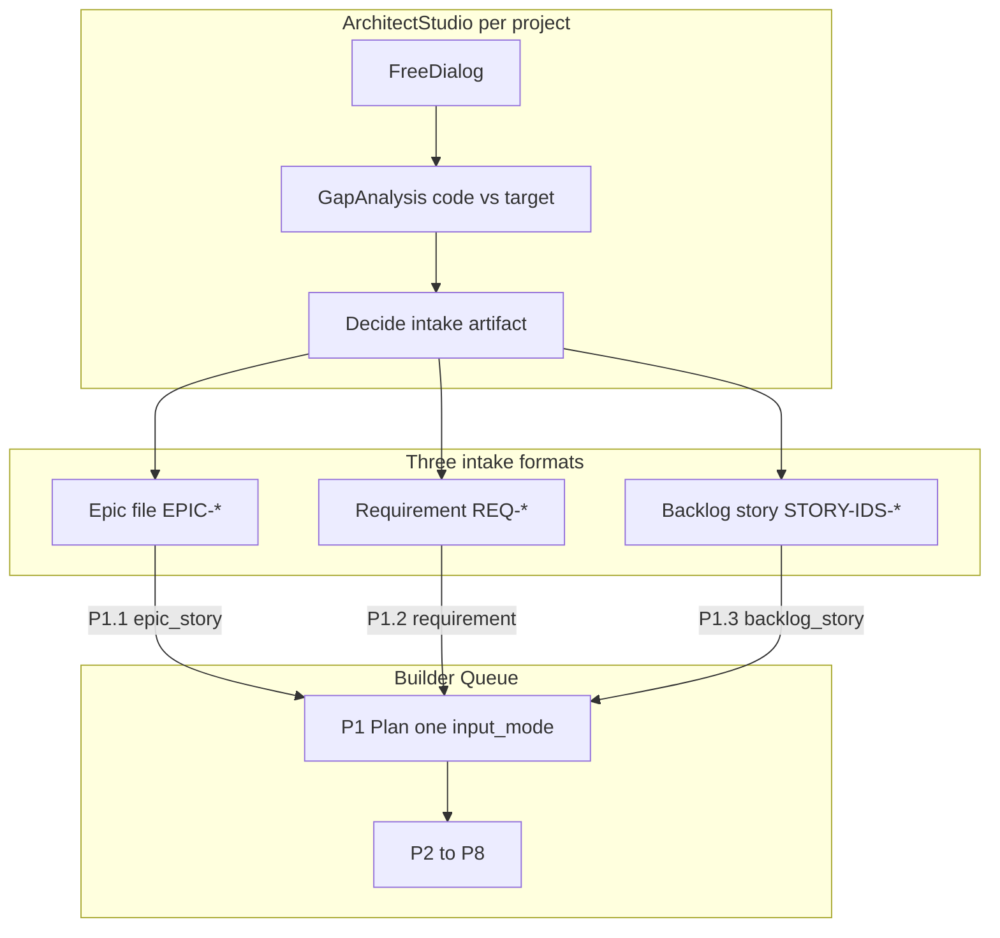
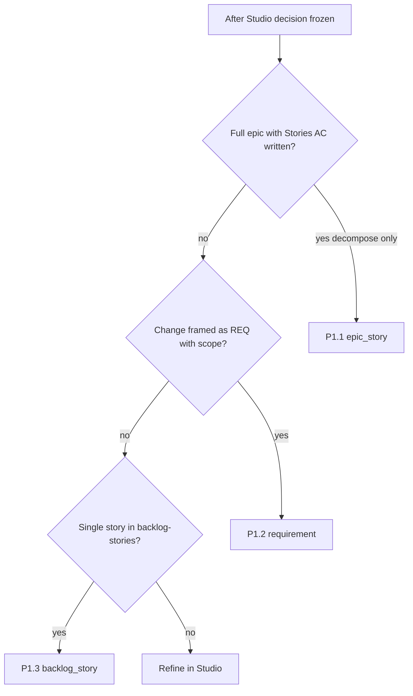

# Модуль 6 — Architect Studio и три входа P1

**Operative SSOT:** [`../core/workflow.md`](../core/workflow.md) §P1.1–P1.3 · [`../contracts/identity-operator-contract.md`](../contracts/identity-operator-contract.md) §4–§5  
**Контекст:** [`00-guide-for-humans.md`](./00-guide-for-humans.md)

Этот документ описает **отдельный процесс мышления** — свободный диалог архитектора per project — и handoff в Builder Queue через **три формата входных артефактов**. Operative промпты P1 здесь **не дублируются**; только смысл и выбор `input_mode`.

---

## 1. Два режима общения (не смешивать)

| Режим | Чат | Цель | Формат |
|-------|-----|------|--------|
| **Architect Studio** | Отдельный диалог, контекст **per project** (`gateway` / `gpt` / `identity`) | Архитектура, функция, gap analysis, целевое состояние | Свободный; Plan/Ask; `@.cursor/rules/analysis.mdc` |
| **Builder Queue** | Сессия по [`session-starter.md`](../core/session-starter.md) | Исполнение по фазам P0–P8 | Жёсткий: одна фаза, verify, pkg |



**Ключевое правило:** Studio **не** создаёт `pkg-*.yaml` и **не** запускает P3. Выход Studio — **один уточнённый файл-якорь** на диске; затем (тот же или новый чат Builder) — явный P1 с `input_mode`.

---

## 2. Architect Studio — что происходит

### Контекст per project

Из [`profiles.yaml`](../specs/profiles.yaml):

| `builder_project` | Документы для Studio | Gap / analysis |
|-------------------|----------------------|----------------|
| `gateway` | `doge-complaints-gateway/docs/requirements/`, `doge-complaints-gateway/docs/tasks/epics/` | `doge-complaints-gateway/docs/analysis/` |
| `gpt` | `GPT UI/docs/requirements/REQ-*.md`, epics под `GPT UI/docs/analysis/tasks/` | `GPT UI/docs/analysis/` |
| `identity` | `doge-identity-service/docs/requirements/`, `docs/tasks/backlog-stories/`, `docs/runtime-docs/` | `doge-identity-service/docs/analysis/` |

В Studio-чате держите в голове один `builder_project` — не смешивайте gateway paths с identity в одном потоке решений.

### Типичные темы (свободный формат)

- Целевая архитектура модуля, границы сервисов, контракты между слоями
- Функциональные сценарии и acceptance criteria «как должно быть»
- **Gap analysis:** фактический код (paths в отчёт) vs целевое состояние, которое задаёт архитектор
- Интерпретация audit-отчётов после P4 — severity и приоритеты, **без** fix в том же сообщении

### Дисциплина analysis.mdc в Studio

- Каждый gap — path к файлу/строке кода **или** к requirement / epic / backlog AC
- Различать: «не реализовано» · «реализовано неверно» · «doc drift»
- Если цель — зафиксировать решение в артеfact, не переходить к implementation в Studio-чате

### Пример реальной цепочки (identity)

1. Gap pass: [`identity-todo-backlog-2026-06-04.md`](../../../doge-identity-service/docs/analysis/identity-todo-backlog-2026-06-04.md) — сырой бэклог из runtime-docs + code facts  
2. Архитектор оформляет story: [`STORY-IDS-EID-01-eid-verification-flow.md`](../../../doge-identity-service/docs/tasks/backlog-stories/STORY-IDS-EID-01-eid-verification-flow.md) (Meta, Scope, AC, «Точки в коде»)  
3. Builder **P1.3** → pipeline story + tasks + [`pkg-000015`](../../../doge-identity-service/docs/tasks/identity-active-packages/pkg-000015-20260606-epic-ids-09-eid-verification-flow.yaml)  
4. P3–P4 → audit [`epic-ids-09-eid-01-audit-2026-06-06.md`](../../../doge-identity-service/docs/analysis/epic-ids-09-eid-01-audit-2026-06-06.md)

Studio дал **backlog story**; Builder превратил её в executable queue.

---

## 3. Три формата входа → три P1

SSOT: workflow §P1.1–P1.3, identity contract §4.

| P1 | `input_mode` | Файл-якорь | Когда после Studio | Что делает P1 |
|----|--------------|------------|-------------------|---------------|
| **P1.1** | `epic_story` | `@$epicFile` — `docs/tasks/epics/EPIC-*.md` | Эпик **уже написан** со Stories/AC; нужна декомпозиция в task tree | Stories только из эпика → tasks → pkg `epic_story_tree` |
| **P1.2** | `requirement` | `@$requirementDoc` — `docs/requirements/NN-*.md` или GPT `REQ-*.md` | Инкремент; gap сведён в **requirement** | Найти **существующий** epic → stories → tasks → pkg |
| **P1.3** | `backlog_story` | `@$storyFile` — `docs/tasks/backlog-stories/STORY-IDS-*.md` | Story готова в backlog; epic может не быть в pipeline | Materialize epic при необходимости → pipeline story → deep tasks → pkg |

**Запрет:** один `input_mode` на Builder-сессию; не смешивать AC requirement, epic-only и backlog в одном pkg ([`identity-operator-contract.md`](../contracts/identity-operator-contract.md) §4).

### Decision tree



---

## 4. Три сценария — развёрнуто

### Сценарий A — Epic-first (P1.1)

**Studio:** проектируете EPIC-IDS-09 / EPIC-M2-* — Goal, Stories, AC, out of scope.

**Артеfact:** один файл в `docs/tasks/epics/`.

**Builder:** `P1 Plan. builder_project: …. input_mode=epic_story. @$epicFile` → workflow §P1.1.

**Типично:** gateway epic tree; identity волна по готовому EPIC-IDS-*.

**Архитектор:** guardrails scope — в execution попадает только то, что уже в эпике.

---

### Сценарий B — Requirement-driven (P1.2)

**Studio:** gap «код vs целевое REQ» → уточняете requirement, напр. [`46-demo-services-enablement-and-response-transparency.md`](../../../doge-complaints-gateway/docs/requirements/46-demo-services-enablement-and-response-transparency.md).

**Артеfact:** requirement doc (не pkg).

**Builder:** P1.2 + `@$requirementDoc`; агент **подбирает существующий эпик**, не плодит параллельный ([`.cursor/rules/builder-operator-habits.mdc`](../../../.cursor/rules/builder-operator-habits.mdc) §6).

**Типично:** gateway REQ waves; GPT `REQ-*` внутри существующего `EPIC-M1-*`.

**Архитектор:** reuse эпиков = системная целостность домена.

---

### Сценарий C — Backlog story intake (P1.3)

**Studio:** gap analysis → todo backlog → одна story с Meta / Scope / AC / «Точки в коде» — см. [EID-01 backlog](../../../doge-identity-service/docs/tasks/backlog-stories/STORY-IDS-EID-01-eid-verification-flow.md).

**Артеfact:** `backlog-stories/STORY-IDS-*.md`; опционально [`INDEX.md`](../../../doge-identity-service/docs/tasks/backlog-stories/INDEX.md).

**Builder:** P1.3 — materialize epic если нет в `epics/` (identity contract §2); **не** полный epic-decompose всего домена.

**Не путать с P1.1:** backlog story = intake **одной** story в pipeline, часто после analysis stages.

---

## 5. Gap analysis, audit и выбор P1

| Стадия | Где | Роль архитектора | Частый следующий артеfact |
|--------|-----|------------------|---------------------------|
| Studio gap | Свободный чат + чтение кода | Gaps с paths; целевое состояние | REQ · backlog story · правка epic |
| P4 audit | External + `docs/analysis/` | Severity; что закрывать | P5 scaffold · REQ · backlog story |
| P5 scaffold | Builder P5 only | Gap → task folders, **не код** | P6 · новый pkg · override |

Якоря audit по `input_mode` — identity contract §5 (requirement vs epic vs backlog story vs `run_mode` override).

---

## 6. Handoff checklist: Studio → Builder

1. [ ] Решение зафиксировано в **одном** файле (epic | requirement | backlog story)  
2. [ ] Выбран **один** `input_mode` для P1  
3. [ ] Builder-сессия: Phase 0 при необходимости → «P1, input_mode=…, @file»  
4. [ ] Operative промпт — workflow §P1.1 / P1.2 / P1.3 (не пересказ Studio-чата)  
5. [ ] После P1: verify → P2 window → P3 ([`02-first-package-and-window.md`](./02-first-package-and-window.md))

### Шаблон сообщения handoff

```text
Architect Studio завершён. Артеfact: @path/to/epic|requirement|backlog-story.md

Переходим в Builder Queue.
builder_project: identity
P1 Plan. input_mode=backlog_story. @doge-identity-service/docs/tasks/backlog-stories/STORY-IDS-….md

Plan only — см. workflow §P1.3.
```

---

## 7. Как архитектор остаётся архитектором

| В Studio | В Builder P1 | В Builder P3 |
|----------|--------------|--------------|
| Целевое состояние, gaps, AC | Декомпозиция, pkg design | Attach plan + window; verify gate |
| Не просить «сразу код» | Не микроменеджить task README | Не переписывать очередь в чате |

Studio — **думать и фиксировать решения на диске**. Builder — **исполнять контракт** по фазам. Разделение сохраняет архитектурную роль: вы проектируете железную дорогу; агент едет по рельсам build window.

---

## Дальше

- Operative P1: [`../core/workflow.md`](../core/workflow.md) §P1  
- Фазы P2–P8: [`03-workflow-phases-explained.md`](./03-workflow-phases-explained.md)  
- CLI после pkg: [`04-cli-and-contracts-explained.md`](./04-cli-and-contracts-explained.md)
