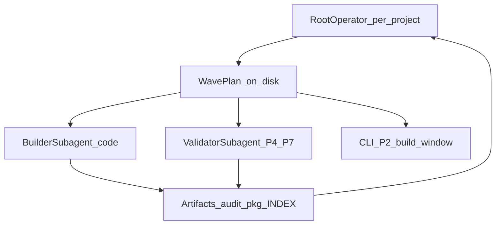

# Operator root orchestrator

**Версия документа:** 1.0 (methodology 1.4.26)  
**Статус:** process spec + implementation roadmap (MVP = docs + discipline; Phase B overnight = proven)  
**SSOT фаз:** [`../core/workflow.md`](../core/workflow.md)  
**Copy UI (не оркестратор):** [`../tools/workflow-console.html`](../tools/workflow-console.html)  
**START (bootstrap):** [`../prompts/operator/operator-root-start.md`](../prompts/operator/operator-root-start.md)  
**WAVE (stories, MVP paste):** [`../prompts/operator/operator-root-wave.md`](../prompts/operator/operator-root-wave.md)  
**SUBAGENT RUN (Phase B overnight):** [`../prompts/operator/operator-root-subagent-run.md`](../prompts/operator/operator-root-subagent-run.md)  
**How-to для человека:** [`./operator-how-to-run-queue.md`](./operator-how-to-run-queue.md)  
**Proven overnight SSOT:** [`./orchestrator-builder-reference.md`](./orchestrator-builder-reference.md)  
**Метод claims:** [`.cursor/rules/analysis.mdc`](../../../../.cursor/rules/analysis.mdc)

---

## Bootstrap (перед волной)

1. **Сначала START** — в новом `OP-<project>` только `$builderProject=` → [`operator-root-start.md`](../prompts/operator/operator-root-start.md).
2. **Session SSOT** на диск:
   ```text
   {tasksRoot}/run-reports/operator-sessions/OP-<project>.session.yaml
   ```
   Поля: titles `OP`/`BLD`/`VAL`, optional `agent_id`, `bind_mode` (`reuse`|`create`|`task`), `status: ready`.
3. **Bind Ask один раз:** reuse (названия чатов) | create (чеклист открыть/переименовать) | task (Phase B stub).
4. **Потом** либо overnight RUN ([`operator-root-subagent-run.md`](../prompts/operator/operator-root-subagent-run.md) — см. how-to [`operator-how-to-run-queue.md`](./operator-how-to-run-queue.md)), либо MVP WAVE ([`operator-root-wave.md`](../prompts/operator/operator-root-wave.md)). Без ready session → сначала START (или RUN создаст session сам).

Packets (MVP): `ROLE=builder` → paste в `builder_chat_title`; `validator` → `validator_chat_title`; CLI → shell. В каждом packet — `DELIVER_TO: <title>`.

---

## 1. Problem / as-is

Оператор прогоняет каждую story/bug через Builder Queue **вручную**:

| Шаг | Куда | Инструмент |
|-----|------|------------|
| P0 / Wave checkpoint | Cursor builder chat | session-starter / workflow |
| P1.3 (если нужно) | Cursor builder | workflow §P1.3 |
| P2 | Shell | `builder_resolve_queue.py --write-build-window` |
| P3 / P6 | Cursor builder | workflow + fixed plan `@attach` |
| P4 / P7 | **Validator chat** (у вас) или Claude external (curriculum) | analysis.mdc |
| P5 | Cursor builder Plan | auto-decide disposition |
| P8 | Cursor builder | git-commit methodology |

**Типичная стоимость:** ~4–7 paste в чат на story (+ 1 CLI), плюс gap-loop P5→P7. На 20 багах — десятки одинаковых вставок.

[`workflow-console.html`](../tools/workflow-console.html) **ускоряет копирование** подставленных fences — но **не** ведёт очередь, не помнит handoff и не двигает фазы сам.

**Operator runtime profile (ваша практика):** на каждый из 4 проектов (`gateway`, `identity`, `spa`, `gpt`) — два Cursor-диалога: **builder (код)** и **validator (P4/P7)**. Curriculum часто пишет P4/P7 → Claude.ai; здесь validator = отдельный Cursor-чат с `analysis.mdc` — допустимый runtime profile, fences те же.

---

## 2. Target model

На **каждый** проект — свой **root operator** чат. Root **не** пишет код и **не** правит product без явной команды. Он:

1. Принимает `@STORY-…` links (и режим очереди).
2. Пишет **wave plan** на диск.
3. Эмитит **handoff packets** в builder / validator / CLI.
4. Двигает state machine только после **verified artifact on disk**.



Четыре root = **четыре независимые очереди** (v1: нет global cross-project orchestrator).

**Hybrid delivery:**

| Stage | Как субагент получает работу |
|-------|------------------------------|
| **MVP** | Root печатает packet → оператор paste/resume в `BLD-*` / `VAL-*` |
| **Phase B** | Root spawn Cursor Task с тем же packet |
| **Phase C** | Optional Cursor SDK batch (future) |

---

## 3. Roles and chat inventory (per project)

| Role | Chat name (convention) | Phases | Forbidden |
|------|------------------------|--------|-----------|
| **Root operator** | `OP-<project>` | intake, wave plan, route, accept/reject, wave MD update, dashboard note | code edits, pytest, invent AC |
| **Builder** | `BLD-<project>` | P0 checkpoint, P1.3, P3, P5, P6, P8 | invent AC; skip `$verifyCmd`; Build/Execute на fixed plan file |
| **Validator** | `VAL-<project>` | P4, P7 | code patches; close gaps without disposition |
| **CLI** | terminal | P2 build window | — |

`<project>` ∈ `gateway` \| `identity` \| `spa` \| `gpt` (landing/capybara — тот же шаблон при необходимости).

Fixed plan: только `@attach` + prompt в **текущем** BLD-чате — [`fixed-builder-plan-execution.md`](./fixed-builder-plan-execution.md).

---

## 4. Operator input contract (в `OP-*`)

Минимум:

```text
builder_project: gateway
stories:
  - @landing/docs/tasks/backlog-stories/bugs/STORY-….md
mode: sequential
```

| Field | Meaning |
|-------|---------|
| `builder_project` | профиль из `specs/profiles.yaml` |
| `stories` | `@` paths; порядок = очередь unless `batched-by-pkg` |
| `mode` | `sequential` (одна story до DONE/BLOCKED) \| `batched-by-pkg` (общий pkg/window) |

Опционально: `$planFile`, active pkg hint, `run_mode=…`, `skip_PA=true` если story canonical.

Перед первой волной: session file из START (см. Bootstrap). Дальше: [`../prompts/operator/operator-root-wave.md`](../prompts/operator/operator-root-wave.md).

---

## 5. Wave plan artifact (root output)

**Path:**

```text
{tasksRoot}/run-reports/operator-waves/wave-<YYYYMMDD>-<slug>.md
```

Пример: `doge-complaints-gateway/docs/tasks/run-reports/operator-waves/wave-20260812-bug-batch.md`.

**Required sections:**

1. Meta: `builder_project`, mode, created, Updated
2. Story queue table: `# | story path | status | current phase | blocked_reason`
3. Per-story checklist: P2 path, P3, P4 audit path, P5 disposition, P6, P7, P8
4. Artifacts registry: `$buildWindowFile`, `$auditReport`, `$priorReaudit`, disposition note
5. Handoff log: `timestamp | ROLE | PHASE | packet_id | result`
6. Stop-rules: verify FAIL → BLOCKED; `WAVE_STALLED_NO_DELTA` → stop P5→P7 loop; `P5_DISPOSITION_INCOMPLETE` → re-P5

Root updates this file after every returned packet (facts from disk only).

---

## 6. Handoff packet schema

Единый блок (paste в BLD/VAL или Task prompt). Root **не** дублирует полный fence из workflow — **заполняет переменные** и указывает «execute workflow §P*».

```text
### HANDOFF PACKET
packet_id: <wave-slug>-<story-key>-<phase>
ROLE: builder | validator | cli
PHASE: P1.3 | P2 | P3 | P4 | P5 | P6 | P7 | P8
builder_project: <…>
DELIVER_TO: <builder_chat_title | validator_chat_title | shell>

@files:
- <paths>

DONE_WHEN:
- <artifact exists on disk with path>
- <short acceptance from story AC / phase>

DO_NOT:
- <phase-specific bans>

RETURN_TO_ROOT:
- paths: <list>
- summary: ≤5 lines (facts + paths only)
- next_phase_hint: <optional>
```

### Packet → console / workflow mapping

| Console / workflow block | ROLE | PHASE |
|--------------------------|------|-------|
| Session starter / Wave checkpoint | builder | P0 |
| P1.3 | builder | P1.3 |
| P2 CLI | cli | P2 |
| P3 / P3 spa UX | builder | P3 |
| P4 / P4 spa UX | validator | P4 |
| P5 | builder | P5 |
| P6 | builder | P6 |
| P7 | validator | P7 |
| P8 | builder | P8 |

P5: auto-decide disposition (no AskQuestion) — [`workflow.md`](../core/workflow.md) §P5.  
P7: no follow-up interview; incomplete map → `P5_DISPOSITION_INCOMPLETE`.

---

## 7. State machine (per story)

```text
QUEUED → PLANNED → P2_CLI → BUILDING(P3)
  → AUDIT_P4 → (GAPS: P5 → P6 → P7)* → COMMIT_P8 → DONE
                                 ↘ BLOCKED
```

| Transition | Gate (verified) |
|------------|-----------------|
| PLANNED | wave MD row exists |
| P2_CLI | `$buildWindowFile` exists (or N/A if `run_mode` only) |
| BUILDING done | story/tasks Done claims with paths |
| AUDIT_P4 | `$auditReport` exists |
| gap loop | disposition table + P6 evidence; P7 report; stop on `WAVE_STALLED_NO_DELTA` |
| COMMIT_P8 | commits per git-commit plan (push only if operator said) |
| BLOCKED | verify FAIL / missing artifact / operator stop |

Root advances **only** after `RETURN_TO_ROOT.paths` exist on disk (Read/Glob) — no memory claims.

---

## 8. Implementation roadmap (задача «как сделать»)

### MVP (docs + discipline) — этот релиз

**Done when:**

1. Этот guide + [`operator-root-wave.md`](../prompts/operator/operator-root-wave.md) в INDEX/MANIFEST.
2. Чаты названы `OP-*` / `BLD-*` / `VAL-*` на 4 проекта.
3. Оператор прогоняет **1** bug: только story `@` в OP → следует packets → обновляет wave MD; **не** вспоминает 8 промптов наизусть.
4. Явно paste: всё ещё ручной paste packet в BLD/VAL и ручной P2 CLI.

**Checklist оператора (MVP):**

1. Открыть `OP-<project>`, вставить input + fence из `operator-root-wave.md`.
2. Принять wave plan path; проверить файл на диске.
3. Для каждого packet: Copy → BLD или VAL → дождаться RETURN → в OP: «packet done, paths: …».
4. OP обновляет wave MD + при materialize stories — dashboard sync (maintenance).
5. Следующий packet / следующая story.

### Phase B — Cursor Task (proven overnight)

**SSOT эталона:** [`orchestrator-builder-reference.md`](./orchestrator-builder-reference.md)  
**Launch:** [`../prompts/operator/operator-root-subagent-run.md`](../prompts/operator/operator-root-subagent-run.md) (`$builderProject` + `$queueSpec`)

- OP spawn/resume **ровно двух** Task: Builder + Validator; ids только в `OP-<project>.session.yaml`.
- Default overnight: `overnight: on` — auto-approve P1.3/P5 GATE, **без** паузы после story; halt только на `стоп|stop|pause|halt`.
- Fences дословно из console/workflow; Plan simulation variant 1 (P1.3a/b, P5a/b).
- Validator: read-only, `analysis.mdc`, no product edits.
- Builder: Agent / plan-sim; fixed `$planFile` только `@attach`, не Build UI.
- BLOCKED (prod/deploy/asset/verify) → очередь дальше, не стоп волны.

### Phase C — Cursor SDK (future)

- Batch bugs via `@cursor/sdk` / `Agent.prompt` local cwd.
- Out of scope для MVP; см. Cursor SDK skill у оператора при внедрении.

### Non-goals / do not break

- P5 auto-decide / P7 incomplete rules
- Dashboard sync on backlog materialize
- Separate PA Studio / UI ADMIN layers (другие prompts)
- Replacing `workflow.md` fences inside packets

---

## 9. Acceptance (этой спеки)

- [ ] Оператор может закрыть 1 story, используя только OP input + packets из wave plan.
- [ ] Документ различает MVP (paste) vs Phase B/C.
- [ ] Таблица console block → packet есть (§6).
- [ ] State machine + stop-rules согласованы с workflow §P5/P7.
- [ ] Нет требования писать код в OP-чате.

---

## 10. Related

| Doc | Role |
|-----|------|
| [`../core/workflow.md`](../core/workflow.md) | Phase fences SSOT |
| [`../core/session-starter.md`](../core/session-starter.md) | P0 |
| [`../workflow/backlog-dashboard-maintenance.md`](../workflow/backlog-dashboard-maintenance.md) | dashboard recount |
| [`../prompts/INDEX.md`](../prompts/INDEX.md) | prompt catalog |
| [`../prompts/operator/operator-root-start.md`](../prompts/operator/operator-root-start.md) | OP bootstrap + session bind |
| [`../prompts/operator/operator-root-wave.md`](../prompts/operator/operator-root-wave.md) | wave MD + packets (MVP paste) |
| [`../prompts/operator/operator-root-subagent-run.md`](../prompts/operator/operator-root-subagent-run.md) | Phase B overnight: profile + queueSpec |
| [`./orchestrator-builder-reference.md`](./orchestrator-builder-reference.md) | Proven two-subagent overnight SSOT |
| [`./operator-how-to-run-queue.md`](./operator-how-to-run-queue.md) | Human how-to: запуск очереди |
| [`./fixed-builder-plan-execution.md`](./fixed-builder-plan-execution.md) | @attach rule |
