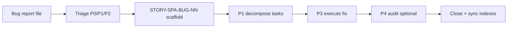

# Bug intake workflow (Builder Queue)

**Profile:** `spa` (template for other profiles)  
**Output zone:** `spa-app/docs/tasks/backlog-stories/bugs/`  
**Process:** same P1→P8 as stories; bugs are **not** mixed into doc-gap G-track without operator decision.

## Flow



## 1. Intake (operator)

Create file from [bug-report-template.md](./bug-report-template.md) in:

`spa-app/docs/tasks/backlog-stories/bugs/inbox/BUG-SPA-YYYYMMDD-<slug>.md`

Attach screenshots to `spa-app/docs/tasks/backlog-stories/bugs/attachments/<bug-id>/`.

Minimum fields:

```yaml
severity: P0|P1|P2
route: "/#/board"
env: local|railway|staging
screenshots: [attachments/BUG-.../screen-1.png]
description: "what happened"
expected: "correct behavior"
actual: "observed behavior"
repro_steps: []
```

## 2. Triage

| Severity | Action |
|----------|--------|
| P0 | Same-day story + hotfix pkg or safe-override |
| P1 | Next pkg wave after active story |
| P2 | backlog `bugs/` package INDEX |

## 3. Story scaffold (P1.3 variant)

- Key: `STORY-SPA-BUG-NN-<slug>`
- Epic: reuse in-scope epic (e.g. EPIC-SPA-03 for filter bug) **or** `EPIC-SPA-BUG` / wave epic if cross-cutting
- **Structure SSOT (spa):** [`spa-app/docs/tasks/backlog-stories/bugs/BUG-STORY-SCHEMA.md`](../../../../spa-app/docs/tasks/backlog-stories/bugs/BUG-STORY-SCHEMA.md) · example [BUG-01](../../../../spa-app/docs/tasks/backlog-stories/bugs/STORY-SPA-BUG-01-story-submission-unavailable.md)
- Tasks: reproduce → **pin layer** → fix → test → gate (minimum; P0 cross-service must not skip pin)

## 4. Execute

- Standard P3 with `react-expert` / domain skill
- Regression test required in AC
- Link bug report in story `decision_ref`

## 5. Close

Sync: package INDEX → root INDEX → bullrun → dashboard (see [backlog-dashboard-maintenance.md](./backlog-dashboard-maintenance.md))

## Related

- [hypothesis-driven-error-analysis.md](../../hypothesis-driven-error-analysis.md) — diagnosis method
- P4 audit workflow — post-fix verification report in `docs/analysis/`
